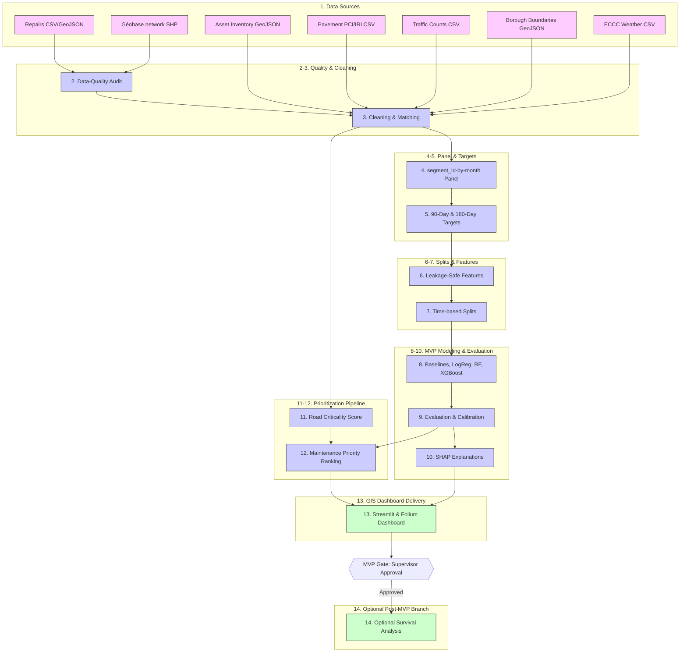

# Montreal Road Risk — Corrected Project Workflow

| Field | Value |
| :--- | :--- |
| **Document purpose** | Project Workflow Specification and Diagram |
| **Project** | Montreal Road Pavement Deterioration Risk Assessment |
| **Phase** | Phase 0 — Definition, Requirements and Feasibility |
| **Status** | Ready for Supervisor Re-review |
| **Last updated** | 2026-07-15 |
| **Source of truth** | Submitted Proposal and Phase 0 Corrections |
| **Next review** | Phase 3 Spatial Matching |

---

## Executive Summary

This document presents the corrected project workflow. It replaces the preliminary conceptual workflow diagram, establishing a 14-stage process that separates the mandatory MVP classification pipeline from the optional post-MVP survival analysis branch.

---

## Corrected Workflow Diagram (Mermaid)

---

## Numbered Workflow Stages

### 1. Verified Data Sources

* Incorporate seven official public datasets from municipal and federal sources (see [data_source_inventory.md](data_source_inventory.md)).

### 2. Data-Quality Audit

* Audit data schemas, check coordinate bounds, and evaluate missingness in Phase 2.

### 3. Cleaning and Spatial Matching

* Clean LineStrings and snap points using candidate tolerances (10m, 25m, 50m) in Phase 3.

### 4. Road-Segment-by-Month Panel

* Construct the core longitudinal modeling table, utilizing the conceptual identifier `segment_id`.

### 5. 90-Day and 180-Day Targets

* Generate binary target variables. Implement right-edge truncation based on the prediction window.

### 6. Leakage-Safe Feature Engineering

* Compute historical repair frequency and weather rolling indices relative to the observation date $t$.

### 7. Time-Based Train/Validation/Test Split

* Split data chronologically by year. Fit scaling and imputation parameters strictly on the training partition.

### 8. Historical Baseline, Logistic Regression, Random Forest, and XGBoost

* Train and baseline the four designated classifiers in Phase 5.

### 9. Evaluation and Probability Calibration

* Evaluate PR-AUC, ROC-AUC, Brier score, and Precision/Capture at K. Apply probability calibration on the validation set.

### 10. SHAP Explanations

* Extract SHAP values to explain risk factors for the tree-based models.

### 11. Separate Road-Criticality Calculation

* Calculate road criticality based on road class, borough population density, and traffic volumes, independent of the prediction probability.

### 12. Maintenance-Priority Ranking

* Calculate the priority score combining probability and criticality to produce ranked candidate lists.

### 13. Streamlit and Folium GIS Dashboard

* Deliver an interactive web dashboard displaying risk heatmaps, priority rankings, and model explanations.

### 14. Optional Survival-Analysis Branch (Post-MVP)

* If the MVP is approved and pavement installation dates are available, proceed to Random Survival Forest analysis.

---

## Responsible-Use Note

Recorded repair interventions are administrative operations and not objective measurements of physical pavement condition. Decision-makers must combine model predictions with field inspections to account for unrecorded deterioration.

---

## Limitations and Pending Verification

* The target prevalence is **unknown** until the panel table is audited.
* The physical identifier for `segment_id` will be verified during Phase 2 schema inspection.
* Snapping distances and weather aggregation methods are candidates to be tested in Phase 3 and Phase 5.

---

## Phase Gate

To transition to Phase 1, the revised workflow must be approved.

* [ ] Workflow stages mapped and numbered.
* [ ] Optional survival branch separated and locked.
* [ ] Responsible-use note included.
* [ ] Supervisor approval received.
